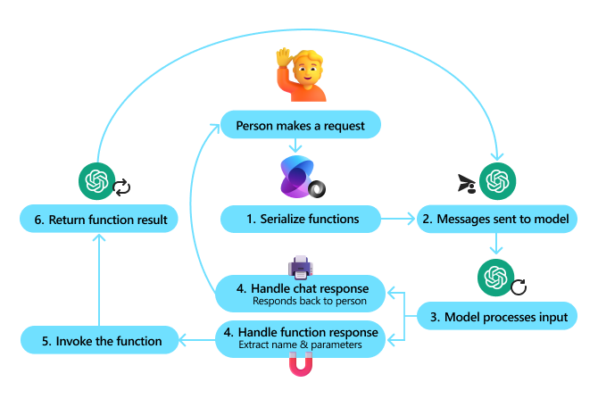

# Tool Use Design Pattern

Tools are interesting because they allow AI agents to have a broader range of capabilities. Instead of the agent having a limited set of actions it can perform, by adding a tool, the agent can now perform a wide range of actions. In this chapter, we will look at the Tool Use Design Pattern, which describes how AI agents can use specific tools to achieve their goals.

## Introduction

In this Project, we're looking to answer the following questions:

- What is the tool use design pattern?
- What are the use cases it can be applied to?
- What are the elements/building blocks needed to implement the design pattern?
- What are the special considerations for using the Tool Use Design Pattern to build trustworthy AI agents?

## What is the Tool Use Design Pattern?

The **Tool Use Design Pattern** focuses on giving LLMs the ability to interact with external tools to achieve specific goals. Tools are code that can be executed by an agent to perform actions. A tool can be a simple function such as a calculator, or an API call to a third-party service such as stock price lookup or weather forecast. In the context of AI agents, tools are designed to be executed by agents in response to **model-generated function calls**.

## What are the use cases it can be applied to?

AI Agents can leverage tools to complete complex tasks, retrieve information, or make decisions. The tool use design pattern is often used in scenarios requiring dynamic interaction with external systems, such as databases, web services, or code interpreters. This ability is useful for a number of different use cases including:

- **Dynamic Information Retrieval:** Agents can query external APIs or databases to fetch up-to-date data (e.g., querying a SQLite database for data analysis, fetching stock prices or weather information).
- **Code Execution and Interpretation:** Agents can execute code or scripts to solve mathematical problems, generate reports, or perform simulations.
- **Workflow Automation:** Automating repetitive or multi-step workflows by integrating tools like task schedulers, email services, or data pipelines.
- **Customer Support:** Agents can interact with CRM systems, ticketing platforms, or knowledge bases to resolve user queries.
- **Content Generation and Editing:** Agents can leverage tools like grammar checkers, text summarizers, or content safety evaluators to assist with content creation tasks.

## What are the elements/building blocks needed to implement the tool use design pattern?

These building blocks allow the AI agent to perform a wide range of tasks. Let's look at the key elements needed to implement the Tool Use Design Pattern:

- **Function/Tool Schemas**: Detailed definitions of available tools, including function name, purpose, required parameters, and expected outputs. These schemas enable the LLM to understand what tools are available and how to construct valid requests.

- **Function Execution Logic**: Governs how and when tools are invoked based on the user’s intent and conversation context. This may include planner modules, routing mechanisms, or conditional flows that determine tool usage dynamically.

- **Message Handling System**: Components that manage the conversational flow between user inputs, LLM responses, tool calls, and tool outputs.

- **Tool Integration Framework**: Infrastructure that connects the agent to various tools, whether they are simple functions or complex external services.

- **Error Handling & Validation**: Mechanisms to handle failures in tool execution, validate parameters, and manage unexpected responses.

- **State Management**: Tracks conversation context, previous tool interactions, and persistent data to ensure consistency across multi-turn interactions.

Next, let's look at Function/Tool Calling in more detail.
 
### Function/Tool Calling

Function calling is the primary way we enable Large Language Models (LLMs) to interact with tools. You will often see 'Function' and 'Tool' used interchangeably because 'functions' (blocks of reusable code) are the 'tools' agents use to carry out tasks. In order for a function's code to be invoked, an LLM must compare the users request against the functions description. To do this a schema containing the descriptions of all the available functions is sent to the LLM. The LLM then selects the most appropriate function for the task and returns its name and arguments. The selected function is invoked, it's response is sent back to the LLM, which uses the information to respond to the users request.

For developers to implement function calling for agents, you will need:

1. An LLM model that supports function calling
2. A schema containing function descriptions
3. The code for each function described

Let's use the example of getting the current time in a city to illustrate:

1. **Initialize an LLM that supports function calling:**

    Not all models support function calling, so it's important to check that the LLM you are using does.     <a href="https://learn.microsoft.com/azure/ai-services/openai/how-to/function-calling" target="_blank">Azure OpenAI</a> supports function calling. We can start by initiating the Azure OpenAI client. 

    ```python
    # Initialize the Azure OpenAI client
    client = AzureOpenAI(
        azure_endpoint = os.getenv("AZURE_OPENAI_ENDPOINT"), 
        api_key=os.getenv("AZURE_OPENAI_API_KEY"),  
        api_version="2024-05-01-preview"
    )
    ```

1. **Create a Function Schema**:

    Next we will define a JSON schema that contains the function name, description of what the function does, and the names and descriptions of the function parameters.
    We will then take this schema and pass it to the client created previously, along with the users request to find the time in San Francisco. What's important to note is that a **tool call** is what is returned, **not** the final answer to the question. As mentioned earlier, the LLM returns the name of the function it selected for the task, and the arguments that will be passed to it.

    ```python
    # Function description for the model to read
    tools = [
        {
            "type": "function",
            "function": {
                "name": "get_current_time",
                "description": "Get the current time in a given location",
                "parameters": {
                    "type": "object",
                    "properties": {
                        "location": {
                            "type": "string",
                            "description": "The city name, e.g. San Francisco",
                        },
                    },
                    "required": ["location"],
                },
            }
        }
    ]
    ```
   
    ```python
  
    # Initial user message
    messages = [{"role": "user", "content": "What's the current time in San Francisco"}] 
  
    # First API call: Ask the model to use the function
      response = client.chat.completions.create(
          model=deployment_name,
          messages=messages,
          tools=tools,
          tool_choice="auto",
      )
  
      # Process the model's response
      response_message = response.choices[0].message
      messages.append(response_message)
  
      print("Model's response:")  

      print(response_message)
  
    ```

    ```bash
    Model's response:
    ChatCompletionMessage(content=None, role='assistant', function_call=None, tool_calls=[ChatCompletionMessageToolCall(id='call_pOsKdUlqvdyttYB67MOj434b', function=Function(arguments='{"location":"San Francisco"}', name='get_current_time'), type='function')])
    ```
  
1. **The function code required to carry out the task:**

    Now that the LLM has chosen which function needs to be run the code that carries out the task needs to be implemented and executed.
    We can implement the code to get the current time in Python. We will also need to write the code to extract the name and arguments from the response_message to get the final result.

    ```python
      def get_current_time(location):
        """Get the current time for a given location"""
        print(f"get_current_time called with location: {location}")  
        location_lower = location.lower()
        
        for key, timezone in TIMEZONE_DATA.items():
            if key in location_lower:
                print(f"Timezone found for {key}")  
                current_time = datetime.now(ZoneInfo(timezone)).strftime("%I:%M %p")
                return json.dumps({
                    "location": location,
                    "current_time": current_time
                })
      
        print(f"No timezone data found for {location_lower}")  
        return json.dumps({"location": location, "current_time": "unknown"})
    ```

     ```python
     # Handle function calls
      if response_message.tool_calls:
          for tool_call in response_message.tool_calls:
              if tool_call.function.name == "get_current_time":
     
                  function_args = json.loads(tool_call.function.arguments)
     
                  time_response = get_current_time(
                      location=function_args.get("location")
                  )
     
                  messages.append({
                      "tool_call_id": tool_call.id,
                      "role": "tool",
                      "name": "get_current_time",
                      "content": time_response,
                  })
      else:
          print("No tool calls were made by the model.")  
  
      # Second API call: Get the final response from the model
      final_response = client.chat.completions.create(
          model=deployment_name,
          messages=messages,
      )
  
      return final_response.choices[0].message.content
     ```

     ```bash
      get_current_time called with location: San Francisco
      Timezone found for san francisco
      The current time in San Francisco is 09:24 AM.
     ```

Function Calling is at the heart of most, if not all agent tool use design, however implementing it from scratch can sometimes be challenging.

## Tool Use Examples with Agentic Frameworks

Here are some examples of how you can implement the Tool Use Design Pattern using different agentic frameworks:

### Semantic Kernel

<a href="https://learn.microsoft.com/azure/ai-services/agents/overview" target="_blank">Semantic Kernel</a> is an open-source AI framework for .NET, Python, and Java developers working with Large Language Models (LLMs). It simplifies the process of using function calling by automatically describing your functions and their parameters to the model through a process called <a href="https://learn.microsoft.com/semantic-kernel/concepts/ai-services/chat-completion/function-calling/?pivots=programming-language-python#1-serializing-the-functions" target="_blank">serializing</a>. It also handles the back-and-forth communication between the model and your code. Another advantage of using an agentic framework like Semantic Kernel, is that it allows you to access pre-built tools like <a href="https://github.com/microsoft/semantic-kernel/blob/main/python/samples/getting_started_with_agents/openai_assistant/step4_assistant_tool_file_search.py" target="_blank">File Search</a> and <a href="https://github.com/microsoft/semantic-kernel/blob/main/python/samples/getting_started_with_agents/openai_assistant/step3_assistant_tool_code_interpreter.py" target="_blank">Code Interpreter</a>.

The following diagram illustrates the process of function calling with Semantic Kernel:



In Semantic Kernel functions/tools are called <a href="https://learn.microsoft.com/semantic-kernel/concepts/plugins/?pivots=programming-language-python" target="_blank">Plugins</a>. We can convert the `get_current_time` function we saw earlier into a plugin by turning it into a class with the function in it. We can also import the `kernel_function` decorator, which takes in the description of the function. When you then create a kernel with the GetCurrentTimePlugin, the kernel will automatically serialize the function and its parameters, creating the schema to send to the LLM in the process.

```python
from semantic_kernel.functions import kernel_function

class GetCurrentTimePlugin:
    async def __init__(self, location):
        self.location = location

    @kernel_function(
        description="Get the current time for a given location"
    )
    def get_current_time(location: str = ""):
        ...

```

```python 
from semantic_kernel import Kernel

# Create the kernel
kernel = Kernel()

# Create the plugin
get_current_time_plugin = GetCurrentTimePlugin(location)

# Add the plugin to the kernel
kernel.add_plugin(get_current_time_plugin)
```
  
## What are the special considerations for using the Tool Use Design Pattern to build trustworthy AI agents?

A common concern with SQL dynamically generated by LLMs is security, particularly the risk of SQL injection or malicious actions, such as dropping or tampering with the database. While these concerns are valid, they can be effectively mitigated by properly configuring database access permissions. For most databases this involves configuring the database as read-only. For database services like PostgreSQL or Azure SQL, the app should be assigned a read-only (SELECT) role.

Running the app in a secure environment further enhances protection. In enterprise scenarios, data is typically extracted and transformed from operational systems into a read-only database or data warehouse with a user-friendly schema. This approach ensures that the data is secure, optimized for performance and accessibility, and that the app has restricted, read-only access.

## Additional Resources

- <a href="https://github.com/Azure-Samples/contoso-creative-writer/tree/main/docs/workshop" target="_blank">Contoso Creative Writer Multi-Agent Workshop</a>
- <a href="https://learn.microsoft.com/semantic-kernel/concepts/ai-services/chat-completion/function-calling/?pivots=programming-language-python#1-serializing-the-functions" target="_blank">Semantic Kernel Function Calling Tutorial</a>
- <a href="https://github.com/microsoft/semantic-kernel/blob/main/python/samples/getting_started_with_agents/openai_assistant/step3_assistant_tool_code_interpreter.py" target="_blank">Semantic Kernel Code Interpreter</a>
- <a href="https://microsoft.github.io/autogen/dev/user-guide/core-user-guide/components/tools.html" target="_blank">Autogen Tools</a>
